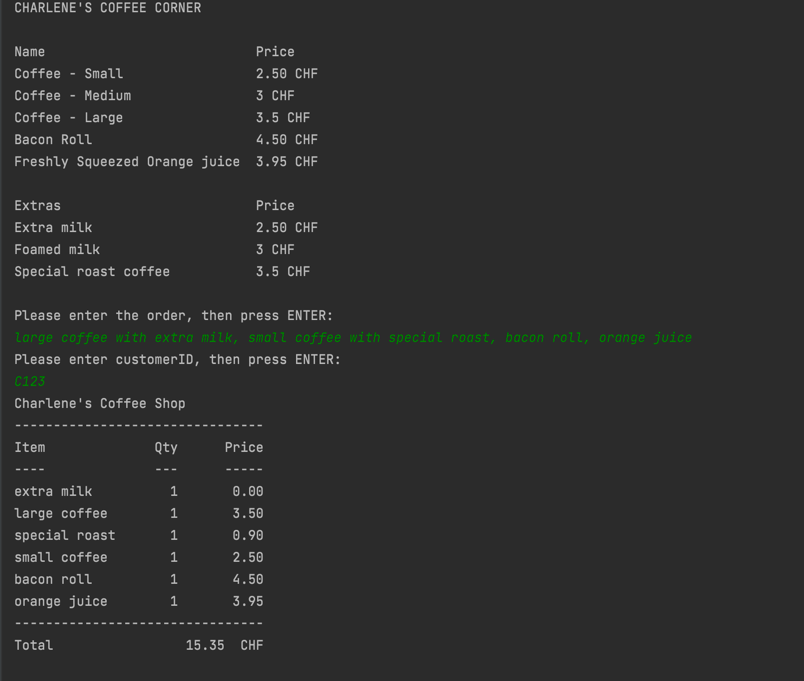

# Charlene's Coffee Corner

##	Introduction
This document describes Charlene's Coffee Corner app. The coffee corner is a system for managing orders and printing receipts.


This document is intended to be read by people who want to get insights how the app works.


#	Overview
##	Purpose of the Software
The primary scope of the component is to take an order and print a receipt.


# Software Design

## Technology Stack
1. Java SE 8
2. Apache Maven


## FUNCTIONAL DESCRIPTION

### Overview

Charlene decided to open her very own little coffee shop on a busy street corner.
Being the careful entrepreneur, she decided to start off with a limited offering, with the option to expand her choice of products, as
business goes.
#####Her Offering
- Coffee (small, medium, large) 2.50 CHF, 3.00 CHF, 3.50 CHF
- Bacon Roll 4.50 CHF
- Freshly squeezed orange juice (0.25l) 3.95 CHF
  Extras:
- Extra milk 0.30 CHF
- Foamed milk 0.50 CHF
- Special roast coffee 0.90 CHF
#####Bonus Program
  Charlene's idea is to attract as many regular‘s as possible to have a steady turnaround.
  She decides to offer a customer stamp card, where every 5th beverage is for free.
  If a customer orders a beverage and a snack, one of the extra's is free. 
###Assumtions
  - Only beverages can have extras.
  - A beverage can have only one extra.
##	API
The API is console based. Administrator provides the order in string format and also the client ID for every order.

# Data Model
This component persists data in memory using maps. </br>

On startup some data are loaded regarding customers and products.
#####Five customers with ID:
- C123
- C124
- C125
- C213
- C214

## Security
##	Authentication
###	Authentication of users
|Role|	Authentication	|Comment|
| ------------- |:-------------:| -----:|
|Anonymous |	None|	 the app uses no authentication for communication|


###	Authorization of users
|Role|	Authorization|	Comment|
| ------------- |:-------------:| -----:|
|Anonymous| 	None|	the app uses no authorization for communication|


###	Logging
No logging provided for the app.
###  Running the application

To run the application execute the following command.

```
mvn clean install

java -jar ./target/coffeeapp-1.0.jar
```

####Example


